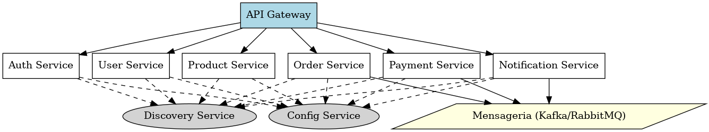

# 🛒 Marketplace de Produtos Digitais

Este projeto é uma aplicação de marketplace de produtos digitais construída com arquitetura de microserviços usando **Java com Spring Boot**. Cada funcionalidade é desacoplada em um serviço independente, garantindo escalabilidade, manutenibilidade e performance.

## 🔧 Tecnologias Utilizadas

- Java 17+
- Spring Boot (Web, Security, Data JPA)
- Spring Cloud (Config, Eureka Discovery)
- API Gateway (Spring Cloud Gateway)
- Kafka ou RabbitMQ para mensageria assíncrona
- PostgreSQL / MongoDB
- Docker & Docker Compose

---

## 🧱 Arquitetura do Sistema

A aplicação segue a arquitetura de microserviços. Os serviços são:

- **API Gateway**: Roteador principal de todas as requisições externas.
- **Auth Service**: Gerenciamento de autenticação e autorização via JWT/OAuth2.
- **User Service**: Cadastro e gerenciamento de usuários.
- **Product Service**: Registro, listagem e gestão de produtos digitais.
- **Order Service**: Fluxo de pedidos e controle de compras.
- **Payment Service**: Processamento e validação de pagamentos.
- **Notification Service**: Envio de notificações via e-mail ou outros canais.
- **Config Server**: Central de configurações externas (Spring Cloud Config).
- **Discovery Server**: Registro de serviços (Eureka Server).
- **Mensageria**: Kafka ou RabbitMQ para comunicação assíncrona.

📌 Veja o diagrama completo da arquitetura:  



---

## 📁 Estrutura dos Repositórios

Cada microserviço possui seu próprio repositório ou pasta, contendo seu próprio `README.md` com instruções específicas:

- `/auth-service`
- `/user-service`
- `/product-service`
- `/order-service`
- `/payment-service`
- `/notification-service`
- `/gateway`
- `/config-server`
- `/discovery-server`

---


## ▶️ Execução com Docker Compose

Em desenvolvimento, os serviços podem ser orquestrados com Docker Compose.  
Cada serviço expõe sua porta padrão e se comunica via Eureka Discovery.

```bash
docker-compose up --build
```

---

## 🤝 Contribuição

Pull Requests são bem-vindos! Verifique os `README` individuais de cada serviço antes de contribuir.

---

## 📄 Licença

Este projeto está licenciado sob a MIT License. Veja o arquivo `LICENSE` para mais detalhes.
